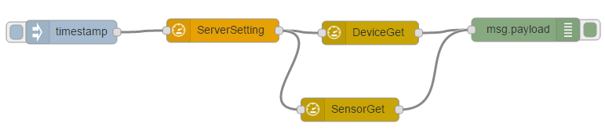

# node-red-contrib-rmm3.1
A collection of [Node-RED](http://nodered.org) nodes to Access RMM 3.1 restful API.

## Install
Use npm to command to install this package locally in the Node-RED modules directory
```bash
npm install node-red-contrib-rmm3.1 
```

## Nodes included in the package
**SWData** Retrieve software and operation system information for specific agent ID.

**HWData** Retrieve hardware monitor information of values for specific agent ID.

**HDDData** Retrieve hard disk information for specific agent ID.

**NetworkData** Retrieve network information for specific agent ID.

**GWSensor** Retreive the IoTGW sensor reported data from database, depend on sensorId existed.

**SUSIControl** Retreive the SUSIControl reported data from database, depend on sensorId existed.

**HDDMonitor** Retreive the HDDMonitor reported data from database, depend on sensorId existed.

**ProcessMonitor** Retreive the ProcessMonitor reported data from database, depend on sensorId existed.

**NetMonitor** Retreive the NetMonitor reported data from database, depend on sensorId existed.

**PowerCtrl** Set device to power on, power off, sleep, hibernate, reboot.

**ProtectCtrl** Set device to install/update McAfee, protect, unprotect, activate.

**AcronisCtrl** Set device to install/update Acronis, backup, recovery, activate.

**ScreenShot** Retrieve current screenshot for specific device.

**SUSICtrlSet** Set SUSIControl value.

**FileDownload** Download a url link and save to specified path.

## Usage example

```
[{"id":"b4dafa51.4b2508","type":"inject","name":"","topic":"","payload":"abc","payloadType":"date","repeat":"","crontab":"","once":false,"x":123,"y":315,"z":"402636cb.bfd9c8","wires":[["2b6f8405.d4907c"]]},{"id":"83616629.7c9e98","type":"DeviceGet","x":504,"y":316,"z":"402636cb.bfd9c8","wires":[["27d72fae.d828d"]]},{"id":"2b6f8405.d4907c","type":"ServerSetting","url":"172.22.13.25","port":"8080","encodestr":"YWRtaW4kYWRtaW4=","flag":"encode","x":316,"y":313,"z":"402636cb.bfd9c8","wires":[["83616629.7c9e98","457bdb14.ba8424"]]},{"id":"27d72fae.d828d","type":"debug","name":"","active":true,"console":"false","complete":"false","x":702,"y":312,"z":"402636cb.bfd9c8","wires":[]},{"id":"457bdb14.ba8424","type":"SensorGet","deviceid":"","x":478,"y":414,"z":"402636cb.bfd9c8","wires":[["27d72fae.d828d"]]}]
```
## Authors
* Advantech RMM Team